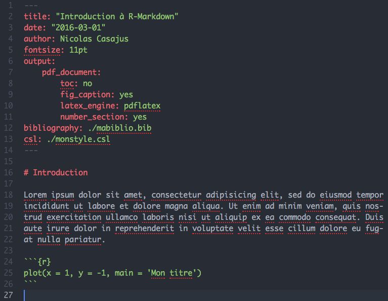

```{r setup, include = FALSE}
knitr::opts_chunk$set(
  comment = "#>",
  collapse = TRUE,
  warning = FALSE,
  message = FALSE,
  dev = "png",
  dpi = 108,
  fig.width = 6,
  fig.height = 4.5,
  fig.align = 'center',
  width = 120
)
rfa <- function(...) icon::fontawesome(...)
```


class: title-slide, middle


## .font200[`r icon::fontawesome("r-project")`asters]

<br>

.instructors[
  .font180[About reproducibility]
  <br><br><br>
  .authors140[David Beauchesne & Kevin Cazelles]
  <br><br>
  `r format(Sys.time(), '%B %d, %Y')`
  <br>
  .font200[
  [`r rfa("github")`](https://github.com/inSilecoInc)
  [`r rfa("database")`](link_to_data)
  [`r rfa("file-pdf")`](link_to_pdf_version)
  ]
]

<br>
</img>


.instructors[Content under [`r rfa("creative-commons")` `r rfa("creative-commons-by")`](https://creativecommons.org/licenses/by/4.0/) unless otherwise specified.]


---

class: inverse, center, middle

# Reproducible workflows


## `r rfa("database")` &nbsp; `r rfa("arrow-right")` &nbsp; `r rfa("r-project")` &nbsp; `r rfa("arrow-right")` &nbsp; `r rfa("cogs")` &nbsp; `r rfa("arrow-right")` &nbsp; `r rfa("file")` &nbsp; `r rfa("arrow-right")` &nbsp; `r rfa("sync-alt")`

---

# Building reproducible workflows

## Dynamic documents

- Creating dynamic documents to automate workflows
  - Code & text living together

--

## Markup language

- Rendering text using tags to format document
  - LaTex, HTML `r rfa("html5")`, Markdown `r rfa("markdown")`
  - Forget word! `r rfa("ban")` `r rfa("file-word")` .font60[as much as allowed by collaborators]

--

## Computing language

- Code for analyses and figures
  - `r rfa("r-project")`, Python `r rfa("python")`, Julia, Matlab, C++, ...
  - Forget excel! `r rfa("ban")` `r rfa("file-excel")` .font60[as much as humanly possible]

---

class: inverse, center, middle

# Markdown


## .font200[`r rfa("markdown")`]


---

# `r rfa("markdown")` Markdown

## The genesis

HTML markup is complex:

```html
<!DOCTYPE html>
<html>
    <body>
        <h1>Section header</h1>
        <p>Paragraph</p>
    </body>
</html>
```

---

# `r rfa("markdown")` Markdown

## The genesis

In comes markdown, a lightweight markup language:

  > Markdown is a text-to-HTML conversion tool for web writers. Markdown allows you to write using an easy-to-read, easy-to-write plain text format, then convert it to structurally valid XHTML (or HTML).

  > The overriding design goal for Markdown’s formatting syntax is to make it as readable as possible. .font90[[John Gruber, 2004](https://daringfireball.net/projects/markdown/)]

---

# `r rfa("markdown")` Markdown

## The genesis

.pull-left[
From this:

```html
<!DOCTYPE html>
<html>
    <body>
        <h1>Section header</h1>
        <p>Paragraphe</p>
    </body>
</html>
```
]


.pull-left[
To this:
```md
# Section header

Paragraph
```
]

---

# `r rfa("markdown")` Markdown

## Variants

- Original developers (John Gruber and Aaron Swartz) did not continue developing Markdown after its release in 2004

--

- Avid enthusiasts took care of that. The results: many variants.
  - [GitHub Flavored Markdown (GFM)](https://docs.github.com/en/github/writing-on-github)
  - [Kramdown](https://kramdown.gettalong.org/)
  - [Markdown Extra](https://michelf.ca/projects/php-markdown/extra/)
  - [Multi Markdow](https://github.com/fletcher/MultiMarkdown/wiki/MultiMarkdown-Syntax-Guide#math-support)
  - [Pandoc's Markdown](https://pandoc.org/MANUAL.html)

--

- [CommonMark](https://commonmark.org/) is addressing standardizing issues with Markdown.

---

# `r rfa("markdown")` Markdown

## Pandoc's Markdown

**Why?**

  - `r rfa("r-project")` uses it through [R Markdown](https://rmarkdown.rstudio.com/lesson-8.html) .font60[much more on this later]

--

**What is Pandoc?**

> a universal document converter

> `r rfa("markdown")` `r rfa("arrow-right")` <i>LaTeX</i> `r rfa("arrow-right")` `r rfa("file-pdf")`
<br/>
> `r rfa("markdown")` `r rfa("arrow-right")` `r rfa("file-word")`
<br/>
> `r rfa("html5")` `r rfa("arrow-right")` `r rfa("markdown")`
<br/>
> **...**

.fon80[See [Pandoc's website](https://pandoc.org/index.html) for a list of all possible conversions]


---

class: inverse, center, middle

# .font200[`r rfa("r-project")`]


</img>
</img>


---

# </img> knitr

[`knitr`](https://cran.r-project.org/package=knitr) .font90[01/2012 (0.1) &nbsp; // &nbsp; 01/2021 (1.3.1)]

> Elegant, flexible, and fast dynamic report generation with R .font80[([Yihui Xie, creator](https://yihui.org/knitr/))]

--

- `knitr` executes code embedded in a dynamic document and "knits" it back into the document.

---

# </img> R Markdown

[`rmarkdown`](https://cran.r-project.org/package=rmarkdown) .font90[09/2014 (0.3.3) &nbsp; // &nbsp; 02/2021 (2.7)]

> Convert R Markdown documents into a variety of formats.

<center></img></center>


---

class: inverse, center, middle

# </img> Basic anatomy


## .font160[**YAML** + `r rfa("markdown")` + `r rfa("r-project")`]

---

# </img> Basic anatomy

## R Markdown file

.pull-left[
- A `r rfa("markdown")` file written with (`r rfa("r-project")`) has the extension `.Rmd` (capital optional)

- Structured in three parts:
  - .font80[**YAML**]: Metadata / front matter
  - `r rfa("markdown")`: Text / document content
  - `r rfa("r-project")`: Code chunks .font70[(optional)]
]

.pull-right[
</img>
]

---

# </img> Basic anatomy

## Exporting .font80[*a.k.a.* knitting 🧶]

.pull-left[
- `knitr` executes the code and converts `.Rmd` to `.md`
- Pandoc renders the `.md` file to the output format you want.
]

.pull-right[
</img>
]


---

# </img> Basic anatomy

## Exporting .font80[*a.k.a.* knitting 🧶]

### `rmarkdown::render()`

- Use [`render()`](https://www.rdocumentation.org/packages/rmarkdown/versions/2.6/topics/render) from the [`rmarkdown`](https://cran.r-project.org/package=rmarkdown) package
- Generates the desired output from the `.Rmd` file

--

Main arguments:

```md
input: name of file to render
output_format: one or more output formats, as specified in the YAML header.
               "all" exports all the specified formats (optional).
output_file: name of output file (optional).
```

--

Minimal example:

```{r, eval = FALSE}
rmarkdown::render(input = "myrmd.Rmd")
```


---

class: inverse, center, middle

# Metadata


## .font160[**YAML**]

---

# .font60[**YAML**] Metadata

- Contains the metadata of the document
- Starts and ends with three dashes (---)
- Comes first in the `.Rmd` file
- Sets *Pandoc* document options with `key: value` (.font60[**YAML**] syntax)
- Available options depend on the output format .font90[(see `?html_document `, `?pdf_document`, `?word_document`)]

--

<br/>

Minimal .font60[**YAML**] metadata for `r rfa("file-pdf")` PDF output:

```yaml
---
output: pdf_document
---
```

---

# .font60[**YAML**] Metadata

## Document information

Title, author and date options

```yaml
---
title: "My document title"
date: "01-03-2021"
author: Me, you, them
output: pdf_document
---
```


---

# .font60[**YAML**] Metadata

## Document options: table of content

- To include a table of contents, use `toc: true`
- To specify the depth of the table of contents, use `toc_depth = depth`

```yaml
---
title: "My document title"
date: "01-03-2021"
author: Me, you, them
output:
  pdf_document:
    toc: true
    toc_depth: 2
---
```

.font90[
`r rfa("exclamation-triangle")` Be sure to respect indentation, either 2 spaces or tabulations
]

---

# .font60[**YAML**] Metadata

## Document options: section numbers

- To include numbered sections, use `number_sections: true`

```yaml
---
title: "My document title"
date: "01-03-2021"
author: Me, you, them
output:
  pdf_document:
    toc: true
    toc_depth: 2
    number_sections: true
---
```

--

.font90[
`r rfa("exclamation-triangle")` To avoid numbering a section, use `{-}` at the end of the section title

```md
# Section title {-}
```
]


---

# .font60[**YAML**] Metadata

## Document options: figures options

- To specify default figure size, use `fig_width: size` and `fig_height = size`
- To include figure captions, use `fig_caption: true`

```yaml
---
title: "My document title"
date: "01-03-2021"
author: Me, you, them
output:
  pdf_document:
    toc: true
    toc_depth: 2
    number_sections: true
    fig_width: 6
    fig_height: 6
    fig_caption: true
---
```

---

# .font60[**YAML**] Metadata

## Document options: additional options

- There is a wide variety of [.font60[**YAML**] options](https://rstudio.com/wp-content/uploads/2016/03/rmarkdown-cheatsheet-2.0.pdf) available

.font90[
```yaml
---
title: "My document title"
date: "01-03-2021"
author: Me, you, them
abstract: "The objective of our work was to ..."
fontfamily: fourier
linestretch: 1
fontsize: 10pt
geometry: margin=1in
urlcolor: red
citecolor: blue
output:
  pdf_document:
    toc: true
  html_document:
    toc: true
  word_document:
    toc: true
---
```
]


---

class: inverse, center, middle

# Text


## .font160[`r rfa("markdown")`]

---

# `r rfa("markdown")` Text formatting


.pull-left[
.font80[
```md
Normal text
```
]
]

.pull-right[
.font80[Normal text]
]

--

.pull-left[
.font80[
```md
_Italic_ *text*
```
]
]

.pull-right[
.font80[_Italic_ *text*]
]

--

.pull-left[
.font80[
```md
__Bold__ **text**
```
]
]

.pull-right[
.font80[__Bold__ **text**]
]

--

.pull-left[
.font80[
```md
***Bold italic*** **_text_**
```
]
]

.pull-right[
.font80[***Bold italic*** **_text_**]
]

--

.pull-left[
.font80[
```md
~~Strikethrough text~~
```
]
]

.pull-right[
.font80[~~Strikethrough text~~]
]

--

.pull-left[
.font80[
```md
Supersript^text^
```
]
]

.pull-right[
.font80[Superscript^2^]
]

--

.pull-left[
.font80[
```md
Subscript~text~
```
]
]

.pull-right[
.font80[Subscript~2~]
]


---

# `r rfa("markdown")` Document formatting

## Titles

.pull-left[
.font80[
```md
# Header 1
## Header 2
### Header 3
#### Header 4
##### Header 5
###### Header 6
```
]
]

.pull-right[
.font80[
# Header 1
## Header 2
### Header 3
#### Header 4
##### Header 5
###### Header 6
]
]

---

# `r rfa("markdown")` Document formatting

## Paragraph


.pull-left[
.font80[
```md
Add an empty line to add

a paragraph
```
]
]

.pull-right[
.font80[
Add an empty line to add

a paragraph
]
]

---

# `r rfa("markdown")` Document formatting

## Lists

.font80[To create a list, use the following symbols: `-` or `*` or `+`]

.font80[You must include an empty line between the beginning of the list and the preceding paragraph]

--

.pull-left[
.font80[
```md
This is a list:

- Element 1
- Element 2
- Element 3
- Element 4
```
]
]

.pull-right[
.font80[
This is a list:

- Element 1
- Element 2
- Element 3
- Element 4]
]


---

# `r rfa("markdown")` Document formatting

## Numbered lists

.font80[To create a numbered list, use a number followed a `.`: `#.`.]

.font80[No matter the order, `r rfa("markdown")` automatically adjusts the list numbers.]

--

.pull-left[
.font80[
```md
This is a numbered list:

1. Element 1
2. Element 2
6. Element 3
7. Element 4
```
]
]

.pull-right[
.font80[
This is a numbered list:

1. Element 1
2. Element 2
6. Element 3
7. Element 4
]
]

---

# `r rfa("markdown")` Document formatting

## List indentations

.font80[To indent elements of your list, use 2 spaces or a tabulation]

--

.pull-left[
.font80[
```md
This is a numbered list:

1. Element 1
  - Element 1.1
  - Element 1.2
7. Element 2
  8. Element 2.1
  9. Element 2.2
```
]
]

.pull-right[
.font80[
This is a numbered list:

1. Element 1
  - Element 1.1
  - Element 1.2
7. Element 2
  8. Element 2.1
  9. Element 2.2
]
]


---

# `r rfa("markdown")` Document formatting

## New numbered lists

.font80[To start a new numbered list (*i.e.* reinitialize numbers), use the tag `<!-- end -->` with an empty line before and afterthe tag]


--

.pull-left[
.font80[
```md
This is a numbered list:

1. Element 1
2. Element 2

<!-- end -->

6. Element 3
7. Element 4
```
]
]

.pull-right[
.font80[
This is a numbered list:

1. Element 1
2. Element 2

<!-- end -->

6. Element 3
7. Element 4
]
]

---

# `r rfa("markdown")` Citations

To add citations, use the `>` before the text

--

```md
> This is a citation

>> This is also a citation
```

> This is a citation

>> This is also a citation

---

# `r rfa("markdown")` Footnotes

To add footnotes, use:

1. The tag `[^footnote]` in the text
2. Description of the footnote anywhere later in the text

--

```md
Ecosystem-based management[^ebm] seeks to address systemic management, monitoring and assessment issues for the environment

...

[^ebm]: See Christensen *et al.* 1996 for a detailed description of ecosystem-based management
```

Ecosystem-based management[^ebm] seeks to address systemic management, monitoring and assessment issues for the environment

...

.font80[^1^See Christensen *et al.* 1996 for a detailed description of ecosystem-based management]


---

# `r rfa("markdown")` Images

To insert a figure, use: ``

```md

```

.pull-left[
<figure>
  </img>
  <figcaption>inSileco</figcaption>
</figure>
]


.pull-right[
**Issue**:

it is not possible to specify dimensions of figures using `r rfa("markdown")`

**Solutions**:

- [`html`](https://www.w3schools.com/tags/att_img_width.asp) syntax for `r rfa("html5")`
- [`latex`](https://www.overleaf.com/learn/latex/Inserting_Images) syntax for `r rfa("file-pdf")`
- Use `r rfa("r-project")` to plot figure as matrix and set dimensions with code chunk options (more on this later)
]

---

# `r rfa("markdown")` Hyperlinks


## Text as hyperlink

To insert a hyperlink, use: `[text](url)`

--

```md
Click [here](https://rmarkdown.rstudio.com/) to visit the `rmarkdown` website
```

Click [here](https://rmarkdown.rstudio.com/) to visit the `rmarkdown` website


---

# `r rfa("markdown")` Hyperlinks

## External image

To insert an external image, use: ``

--

```md

```


---

# `r rfa("markdown")` Hyperlinks

## Image as hyperlink

To use an image as an external link, use: `[](url)`

--

.font70[
```md
[](https://www.bloomberg.com/graphics/2020-us-election-results)
```
]

[](https://www.bloomberg.com/graphics/2020-us-election-results)

---

# `r rfa("markdown")` Hyperlinks

## Link to section

To add a link to a text section:

- Add dentifier tag to section with `# Section {#tag}` (can be higher level sections).

```md
# Introduction {#intro}
```

--

- Refer to it in the text using `[text](tag)`


```md
This was discussed in the [introduction](#intro)
```

---

# `r rfa("markdown")` Tables

The simplest way to make tables in markdown:

- `|` seperates columns
- `-` identify headers
- `:` specifies text alignment

.pull-left[

```md
| Left | Center | Right |
| :--- | :----: | ----: |
| 12   | 100    | 1     |
| 13   | 214    | 43    |
| 14   | 234    | 10    |
```
]

.pull-right[
| Left | Center | Right |
| :--- | :----: | ----: |
| 12   | 100    | 1     |
| 13   | 214    | 43    |
| 14   | 234    | 10    |
]

--

<br/>
.font90[For more options, you can create your tables directly using `r rfa("r-project")` and export them in a code chunk using the [`knitr::kable`](https://cran.r-project.org/package=knitr) function and [`kableExtra`](https://cran.r-project.org/package=kableExtra) package.

See this [website](https://cran.r-project.org/web/packages/kableExtra/vignettes/awesome_table_in_html.html) for more.]


---

# `r rfa("markdown")` Mathematical equations and symbols

Mathematical equations and symbols can be incorporated in the text using $L^AT_EX$ [syntax](https://en.wikibooks.org/wiki/LaTeX/Mathematics) and `$` tags.

- Use single `$` for inline equations and symbols: `$math$`
- Use double `$$` for equation blocks: <code>$$equation block$$ </code>

--

.pull-left[
```md
According to Einstein, mass-energy
equivalence can be expressed as:

$$E = mc^2$$,

where $E$ is energy, $m$ is mass,
and $c$ is the speed of light.
```
]

.pull-right[
.font90[
According to Einstein, mass-energy
equivalence can be expressed as:

$$E = mc^2$$

where $E$ is energy, $m$ is mass,
and $c$ is the speed of light.
]
]


---

class: inverse, center, middle

#  `r rfa("code")` Code chunks

<html><div style='float:left'></div><hr color='#ffdd55'style="margin-top: -60px;" size=1px width=720px></html>

## The `r rfa("r-project")`  part

---

# `r rfa("code")` Code chunks

```{r include=FALSE}
knitr::opts_chunk$set(eval=FALSE)
```


````md
This text is written in markdown

```{r}`r ''`
library(tibble)
data(iris)
head(iris)
```
````

- `r rfa("exclamation-triangle")` `r` between brackets `{}`, why is that?
- Where is the `r rfa("r-project")` code and the `r rfa("markdown")` section?


---

# `r rfa("code")` Code chunks

### Code

```{r}
library(tibble)
data(iris)
head(iris)
```

### Print output

```{r echo = FALSE, eval = TRUE}
library(tibble)
data(iris)
head(iris)
```


---

# `r rfa("code")` Code chunks
.pull-left[

### Code

```{r}
library(ggplot2)
data(iris)
ggplot(
      data=iris,
      aes(x = Sepal.Length,
          y = Sepal.Width)
  ) +
geom_point(
  aes(color=Species, shape=Species)
) +
xlab("Sepal Length") +
ylab("Sepal Width") +
ggtitle("Sepal Length-Width")
```
]

.pull-right[
### Graphic output

```{r echo = FALSE, eval = TRUE, dpi=300, fig.height=5, fig.width=5}
library(ggplot2)
data(iris)
ggplot(
      data=iris,
      aes(x = Sepal.Length,
          y = Sepal.Width)
  ) +
  geom_point(aes(color=Species, shape=Species)) +
  xlab("Sepal Length") +  ylab("Sepal Width") +
  ggtitle("Sepal Length-Width")
```
]

---

# `r rfa("code")` Code chunks

.pull-left[
### Code

```{r}
library(leaflet)
leaflet(height=400, width=400) %>%
  addTiles() %>%
  addMarkers(lng=174.768, lat=-36.852,
             popup="The birthplace of R")
```
]

.pull-right[
<h3 style="margin-bottom:10px;">Map</h3>

```{r echo = FALSE, eval = TRUE, dpi=300}
library(leaflet)
leaflet(height=400, width=400) %>%
  addTiles() %>%
  addMarkers(lng=174.768, lat=-36.852,
             popup="The birthplace of R")
```
]


---

# `r rfa("code")` Code chunks

.pull-left[
### Code

```{r}
library(rbokeh)
p <- figure() %>%
  ly_points(Sepal.Length, Sepal.Width,
    data = iris,
    color = Species, glyph = Species,
    hover = list(Sepal.Length, Sepal.Width))
p
```
]

.pull-right[
<h3 style="margin-bottom:10px;">Map</h3>

```{r echo = FALSE, eval = TRUE, warning=FALSE, dpi = 300}
library(rbokeh)
p <- figure(width = 400, height = 400)  %>%
  ly_points(Sepal.Length, Sepal.Width, data = iris,
    color = Species, glyph = Species,
    hover = list(Sepal.Length, Sepal.Width))
p
```
]

```{r include=FALSE, eval = TRUE}
knitr::opts_chunk$set(eval=TRUE)
```

---

# `r rfa("code")` Inline code chunks

### `r rfa("code")` Syntax

We studied `` `r
length(levels(iris$Species))` `` iris species and took
measurements on `` `r
nrow(iris)` `` flowers.

We found that Iris virginica had the longest sepal with a mean of
`` `r
mean(subset(iris,Species=="virginica")$Sepal.Length)`
`` millimeters!

### `r rfa("file-alt")` Output

````md
This text is written in markdown.

We studied `r length(levels(iris$Species))` iris species and took measurements on `r nrow(iris)` flowers.

We found that Iris virginica had the longest sepal with a mean of `r mean(iris$Sepal.Length[iris$Species=="virginica"])` millimeters!
````


---


# Wrapping up for today

✔️ **Document your document**: use YAML to set up meaningful metadata

✔️ **Style your document**: use YAML to add options to your chosen output format

✔️ **Organize your text**: use markdown headers with `#`

✔️ **Style your text**: use markdown **bold**, *italics*, `r rfa("list-ul")` bullets, `r rfa("list-ol")` lists, hyperlinks, ...

✔️ **Organize your code**: use `knitr` chunk labels

✔️ **Export your document**: use `rmarkdown::render()`

✔️ **Enjoy a simplified life** .font50[most of the time]


---

# Exercice

## Context

- *The goal of the exercice is to apply what we have seen today to generate a dynamic document using R Markdown.*

--

- *To do this, we will use data on Palmer penguins from [Dr. Kristen Gorman](https://www.uaf.edu/cfos/people/faculty/detail/kristen-gorman.php) and the [Palmer Station, Antarctica LTER](https://pal.lternet.edu/).*

--

- *Data are available through the [`palmerpenguin`](https://github.com/allisonhorst/palmerpenguins) R package.*

```{r palmer, eval = FALSE}
library(palmerpenguins)
data(package = 'palmerpenguins')
```

---

# Exercice

## Context

```{r load, echo = FALSE}
library(palmerpenguins)
```
```{r head}
head(penguins)
```

---

# Exercice

## Task

.font90[
**1)** Install the `palmerpenguins` R Package;

**2)** Create a new R Markdown document (`.rmd`);

**3)** Write a .font80[**YAML**] header including the document title, the authors, the date, and output formats html, pdf and word with a table of content for each;

**4)** Include a single section (level 1) and two subsections (level 2);

**5)** In the first subsection:

  - Add paragraphs including normal and formatted text (italic, bold);

  - Add artwork from @allison_horst on palmer penguins found on the `palmerpenguins` R Package GitHub repository (https://github.com/allisonhorst/palmerpenguins) as an external image.

  - Add a footnote to the artwork that states: *"Artwork by @allison_horst"*.

  - Add a code chunk that loads the `palmerpenguins` package and `penguins` dataset. Generate a table with to visualize the first 20 lines of the dataset. For more advanced users, you can use the [`kableExtra`](https://cran.r-project.org/package=kableExtra) R Package to format the table.
]

---

# Exercice

## Task

.font90[
**6)** In the second subsection:

  - Copy the following text and use inline code chunks to fill in the blanks:

    > The penguins dataset contains data on \_\_\_\_ individuals, \_\_\_\_ species, and from \_\_\_\_ islands. Across individuals, the mean flipper length is \_\_\_\_.

  - In the previous text, add a hyperlink to the `palmerpenguins` R Package GitHub repository when a user clicks on [penguins dataset](https://github.com/allisonhorst/palmerpenguins);

  - Add a code chunk that generates a scatterplot of flipper length on the x-axis and body mass on the y-axis.

**7)** Render `.html`, `.pdf` and `.docx` documents.
]


```{r, echo = FALSE, purl = FALSE}
countdown::countdown(minutes = 30, seconds = 0)
```


---


# What we did yesterday

✔️ **Document your document**: use YAML to set up meaningful metadata

✔️ **Style your document**: use YAML to add options to your chosen output format

✔️ **Organize your text**: use markdown headers with `#`

✔️ **Style your text**: use markdown **bold**, *italics*, `r rfa("list-ul")` bullets, `r rfa("list-ol")` lists, hyperlinks, ...

✔️ **Organize your code**: use `knitr` chunk labels

✔️ **Export your document**: use `rmarkdown::render()`

✔️ **Enjoy a simplified life** .font50[most of the time]


---

class: inverse, center, middle

# `r rfa("rocket")` Chunk options

<html><div style='float:left'></div><hr color='#ffdd55' style="margin-top: -60px;" size=1px width=720px></html>

---

# `r rfa("code")` Code chunk options


.pull-left[
- Place between curly braces
  `{r option=value}`

- Multiple options separated by commas
  `{r option1=value, option2=value}`

- Label your code chunk!
</img>

]


.pull-right[

.font90[
````md
```{r dispIris, option1=value, option2=value}`r ''`
library(tibble)
data(iris)
head(iris)
```
````
]
]

---

# `r rfa("code")` Code chunk options

Chunk output can be customised with [numerous options](https://yihui.name/knitr/options/):

```{r}
str(knitr::opts_chunk$get())
```

---

# `r rfa("code")` Code chunk options

## Default options

.pull-left[

### `r rfa("code")` Syntax

````md
```{r}`r ''`
head(iris)
```
````

]

.pull-right[

### `r rfa("file-alt")` Output

```{r}
head(iris)
```

]

---

# `r rfa("code")` Code chunk options

## Option `echo`

.pull-left[

### `r rfa("code")` Syntax

````md
```{r echo = FALSE}`r ''`
head(iris)
```
````

]

.pull-right[

### `r rfa("file-alt")` Output

```{r echo = FALSE}
head(iris)
```
]


- Display results but not code.
- Useful to present results to people not interested by the code.
- Use `echo = -1` to hide only the first line of a code chunk.

---

# `r rfa("code")` Code chunk options

## Option `eval`


.pull-left[
### `r rfa("code")` Syntax
````md
```{r eval = FALSE}`r ''`
head(iris)
```
````
]

.pull-right[
### `r rfa("file-alt")` Output
```{r eval = FALSE}
head(iris)
```
]

- Code is not evaluated.
- Useful to show exemple code.
- Use `eval = -1` to evaluate every line of a code chunk except the first.


---

# `r rfa("code")` Code chunk options

## Option `include`

.pull-left[
### `r rfa("code")` Syntax
````md
```{r include = FALSE}`r ''`
head(iris)
```
````
]

.pull-right[
### `r rfa("file-alt")` Output
```{r include = FALSE}
head(iris)
```
]

- Code is evaluated but no output (code, results and figures) is displayed.
- Useful in setup options and package installation.

---

# `r rfa("code")` Code chunk options

## Option `results`


.pull-left[
### `r rfa("code")` Syntax
````md
```{r results = "hold"}`r ''`
1 + 1
2 + 2
```
````
]

.pull-right[
### `r rfa("file-alt")` Output
```{r results = "hold"}
1 + 1
2 + 2
```
]

- Hold all results in a code chunk and display them at the end.

---

# `r rfa("code")` Code chunk options

## Option `results`

.pull-left[
### `r rfa("code")` Syntax
````md
```{r results = "hide"}`r ''`
1 + 1
ggplot(data = iris,
       aes(x = Petal.Length,
           y = Petal.Width)) +
  geom_point()
```
````

- Hide results but not plots

]

.pull-right[
### `r rfa("file-alt")` Output
```{r results = "hide", fig.height=3.5, fig.width=4, fig.retina=3, fig.align='center'}
1 + 1
ggplot(data = iris,
       aes(x = Petal.Length,
           y = Petal.Width)) +
  geom_point()
```
]

---

# `r rfa("code")` Code chunk options

## Options `fig.height` & `fig.width`

.pull-left[
### `r rfa("code")` Syntax
````md
```{r fig.height = 3,
      fig.width = 5,}`r ''`
ggplot(data = iris,
       aes( x = Sepal.Length,
            y = Sepal.Width,
            color = Species)) +
  geom_point()
```
````
]


.pull-right[
### `r rfa("file-alt")` Output
```{r fig.height = 3,fig.width = 5,echo = FALSE,dpi = 300}
ggplot(data = iris,
       aes(x = Sepal.Length,
           y = Sepal.Width,
           color = Species)) +
  geom_point()
```
]

- width and height of the plot in inches
- Note that options are separated by commas


---

# `r rfa("code")` Code chunk options

## Options `fig.cap`

.pull-left[
### `r rfa("code")` Syntax
````md
```{r fig.height = 3,
      fig.width = 5,
      fig.cap = 'Awesome figure'}`r ''`
ggplot(data = iris,
       aes( x = Sepal.Length,
            y = Sepal.Width,
            color = Species)) +
  geom_point()
```
````
]


.pull-right[
### `r rfa("file-alt")` Output
```{r fig.height = 3,fig.width = 5,echo = FALSE,dpi = 300,fig.cap = 'Awesome figure'}
ggplot(data = iris,
       aes(x = Sepal.Length,
           y = Sepal.Width,
           color = Species)) +
  geom_point()
```
]


---

# `r rfa("code")` Code chunk options

## What output each option suppresses?

Option             | Run code | Show code | Output | Plots | Messages | Warnings
-------------------|:--------:|:---------:|:------:|:-----:|:--------:|:-------:
`eval = FALSE`     |`r rfa("times")`|         |`r rfa("times")`|`r rfa("times")`|`r rfa("times")`|`r rfa("times")`
`include = FALSE`  | |`r rfa("times")`|`r rfa("times")`|`r rfa("times")`|`r rfa("times")`|`r rfa("times")`
`echo = FALSE`     |  |`r rfa("times")`|     |    |      |
`results = "hide"` |        |        |`r rfa("times")`|     |        |
`fig.show = "hide"`|        |       |     | `r rfa("times")`|      |
`message = FALSE`  |          |           |        |       |`r rfa("times")`|
`warning = FALSE`  |          |           |        |       |          |`r rfa("times")`

Table from [R for Data Science](https://r4ds.had.co.nz/r-markdown.html#chunk-options)

---

# `r rfa("code")` Code chunk options

## Global code chunk options

### Setup

You can change the default chunk options for all following chunks in your document.

````md
```{r include = FALSE}`r ''`
knitr::opts_chunk$set(
  collapse = TRUE,
  cache = TRUE,
  comment = "#>",
  fig.width = 6,
  fig.align = "center"
)
```
````


---

class: inverse, center, middle

# Bibliography and citations


</img>

---

# Bibliography

## Bibliographic files

- Bibliographies are typically included to a `.Rmd` document using an external bibliographic file

--

- *Pandoc* can use a wide variety of [bibliographic files](https://rmarkdown.rstudio.com/authoring_bibliographies_and_citations.html#Specifying_a_Bibliography) to manage bibliographies and citations.

--

- For scientific writing, we recommend using a `mybiblio.bib` file in BiBTeX format, which you can export from your favorite reference manager software (*e.g.* [Zotero](https://www.zotero.org/), [`r rfa("mendeley")` Mendeley](https://www.mendeley.com/), [EndNote](https://endnote.com/))

--

- Note that bibliographic metadata can be included in the [YAML header](https://rmarkdown.rstudio.com/authoring_bibliographies_and_citations.html#Inline_References). We however do not recommend using this strategy, unless you wish to cite few references.


---

# Bibliography

## `.bib` file

```md
@article{galbraith2012,
  author = {Galbraith, Peter S. and Larouche, Pierre and Chass{\'e}, Jo{\"e}l and Petrie, Brian},
  title = {Sea-Surface Temperature in Relation to Air Temperature in the {{Gulf}} of {{St}}. {{Lawrence}}: {{Interdecadal}} Variability and Long Term Trends},
  journal = {Deep Sea Research Part II: Topical Studies in Oceanography},
  volume = {77-80},
  pages = {10--20},
  year = {2012},
  doi = {10.1016/j.dsr2.2012.04.001},
  series = {Satellite {{Oceanography}} and {{Climate Change}}}
}
```

- Use the citation key `galbraith2012` for in-text citations (more on this later)

---

# Bibliography

## Include to `.Rmd`

- Include a bibliography to a `.Rmd` in the .font60[**YAML**] header using the `bibliography` option

```yaml
---
title: "My document title"
date: "01-03-2021"
author: Me, you, them
output: pdf_document
bibliography: mybiblio.bib
---
```

.font90[
`r rfa("exclamation-triangle")` Be sure that the path to your `.bib` file is well identified.
]


---

# Bibliography

## Placement

- A bibliography will be added at the end of the document by default. Use an appropriate header at the end and you are good to go.

```md
...that will revolutionize the way we think about science.

# References
```

--

- If you wish to include text after the bibliography, such as an appendix, your can use the `<div id="refs"></div>` HTML tag (see [here](https://bookdown.org/yihui/rmarkdown-cookbook/bibliography.html) for more on this):

```md
...that will revolutionize the way we think about science.

# References

<div id="refs"></div>

# Appendix
```

---

# Bibliography

## Citation syntax

- Use citation key with `@` to refer to a reference: `@id`

.pull-left[
.font80[
```md
Cite in parentheses [@galbraith2012].
```
]
]

.pull-right[
.font80[Cite in parentheses (Galbraith et al. 2012)]
]

--

.pull-left[
.font80[
```md
Cite in parentheses [@galbraith2012; @cazelles2018].
```
]
]

.pull-right[
.font80[Cite in parentheses (Galbraith et al. 2012, Cazelles et al. 2018)]
]

--

.pull-left[
.font80[
```md
Cite in parentheses + text [see @galbraith2012 pp. 30].
```
]
]

.pull-right[
.font80[Cite in parentheses + text (see Galbraith et al. 2012 pp. 30)]
]

--

.pull-left[
.font80[
```md
Cite @galbraith2012 in a sentence.
```
]
]

.pull-right[
.font80[Cite Galbraith et al. (2012) in a sentence.]
]


---

# Bibliography

## Styling

- By default, pandoc uses the Chicago author-date format
- You can use another style by specifying CSL style files with the the `csl` option in the .font60[**YAML**] header.
- CSL files contain bibliographic and citation formatting informations.
- There are hundreds of styles available on [GitHub](https://github.com/citation-style-language/styles) and scientific journals often provide their own CSL file.

```yaml
---
title: "My document title"
date: "01-03-2021"
author: Me, you, them
output: pdf_document
bibliography: mybiblio.bib
csl: mystyle.csl
---
```

.font90[
`r rfa("exclamation-triangle")` Be sure that the path to your `.csl` file is well identified.
]


---

class: inverse, center, middle

# Customizing documents


---

# Customizing documents

## `r rfa("html5")` Themes

- There are 12 custom themes available in `rmarkdown`, and multiple others available through numerous R packages. See [here](https://www.datadreaming.org/post/r-markdown-theme-gallery/) and [here](https://cran.r-project.org/web/packages/prettydoc/vignettes/tactile.html) for examples.

```yaml
---
title: Awesome report
author: Me, You, Them
date: 2021-03-01
output:
  html_document:
    theme: lumen
---
```

---

# Customizing documents

## `r rfa("file-pdf")` Templates

- Specify a LaTeX template `.tex` file to use pre-specified document formatting guidelines. See [here](https://www.overleaf.com/latex/templates) for many templates. Many scientific journals provide LaTeX templates.
- Download the desired template and refer to it in the .font80[**YAML**] header.


```yaml
---
title: Awesome report
author: Me, You, Them
date: 2021-03-01
output:
  pdf_document:
    template: my_template.tex
---
```

---

# `r rfa("book")` The `down` universe

- [`bookdown`](https://bookdown.org/): Write a notebook
- [`csasdown`](https://github.com/pbs-assess/csasdown): Write a CSAS document
- [`thesisdown`](https://github.com/ismayc/thesisdown): Write a thesis
- [`rticles`](https://github.com/rstudio/rticles): Write a scientific article
- [`posterdown`](https://github.com/brentthorne/posterdown): Create a poster
- [`xaringan`](https://github.com/yihui/xaringan): Create nice presentation
- [`vitae`](https://github.com/mitchelloharawild/vitae): Build a CV
- [`blogdown`](https://bookdown.org/yihui/blogdown/): Generate a blog
- [`pkgdown`](https://pkgdown.r-lib.org/): Generate R package documentation

---

class: inverse, center, middle

# Wrapping up


</img>


---


# Wrapping up

✔️ **Document your document**: use YAML to set up meaningful metadata

✔️ **Style your document**: use YAML to add options to your chosen output format

✔️ **Organize your text**: use markdown headers with `#`

✔️ **Organize your code**: use `knitr` chunk labels

✔️ **Style your text**: use markdown **bold**, *italics*, `r rfa("list-ul")` bullets, `r rfa("list-ol")` lists, hyperlinks, ...

✔️ **Style your output**: use `knitr` chunk options

✔️ **Add a bibliography**: use `@id`, `mybiblio.bib`, `mystyle.csl`

✔️ **Customize your documents**: use themes and templates, or other tools

✔️ **Export your document**: use `rmarkdown::render()`

✔️ **Enjoy a simplified life** .font50[most of the time]


---

# Exercice

## Context

- *The goal of the exercice is to apply what we have seen today to update the dynamic document with generated yesterday using R Markdown.*

--

- *We will thus begin where we left off yesterday, i.e. with the `.rmd` you created.*

---

# Exercice

## Task

.font90[
**1)** Open the `.rmd` file that you created yesterday;

**2)** Give the labels `table` and `figure` to the code chunks;

**3)** Modify code chunk options so that the code is not visible in the report;

**4)** Modify `figure` code chunk options to set figure size and include a caption;

**5)** Using your reference manager, export a bibliographic file in BiBTeX format titled `mybiblio.bib` and store it in the same folder as your `.rmd` file;

**6)** Include `mybiblio.bib` to the .font80[**YAML**] header;

**7)** Within the document body, add citations from your bibliographic files using proper citation keys `@id`;
]

---

# Exercice

## Task

.font90[
**8)** Change the default citation format (Chicago style) for the format from *The American Naturalist*:

  - Download the `csl` file from [https://www.zotero.org/styles](https://www.zotero.org/styles) and store it in the same folder as your `.rmd` file

  - Include `new-style.csl` to the .font80[**YAML**] header

**9)** Add a section header at the end for your reference list

**10)** For the html document output, use the `lumen` theme

**11)** Render `.html`, `.pdf` and `.docx` documents.
]


```{r, echo = FALSE, purl = FALSE}
countdown::countdown(minutes = 30, seconds = 0)
```


<!-- rmarkdown::render('index_DB.Rmd') -->
